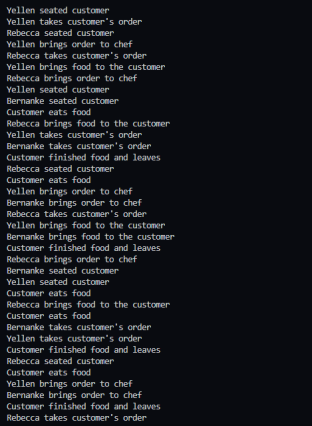
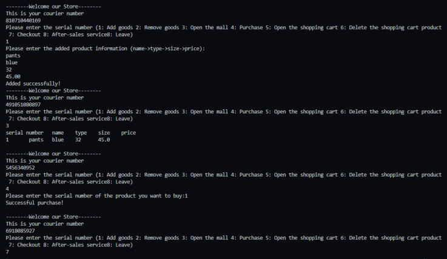

# CS212-Projects
All 3 projects for class CS212

### Introduction
These are the three final projects for our CS212 summer class. Project one was done by Buppi Khan. Project 2 was done by Gangjun Jiang (Tony), Project 3 were done by Arvind Majumder and Mahfuz Rahim. White paper was done by Minsoo (Sam) Kim.

### Powerpoint 
The power point presentation, project 3, https://docs.google.com/presentation/d/1t3O8msx9dtc6ZhWxj1tT1Gia7_uBmp77a6zV4BHteJQ/edit#slide=id.g13a886df010_0_5

### Video links: 
Project 1 video presentation
link

Project 2 video presentation
link

Project 3 video presentation
https://youtu.be/td5VT3X2sIY

### Outputs: 

